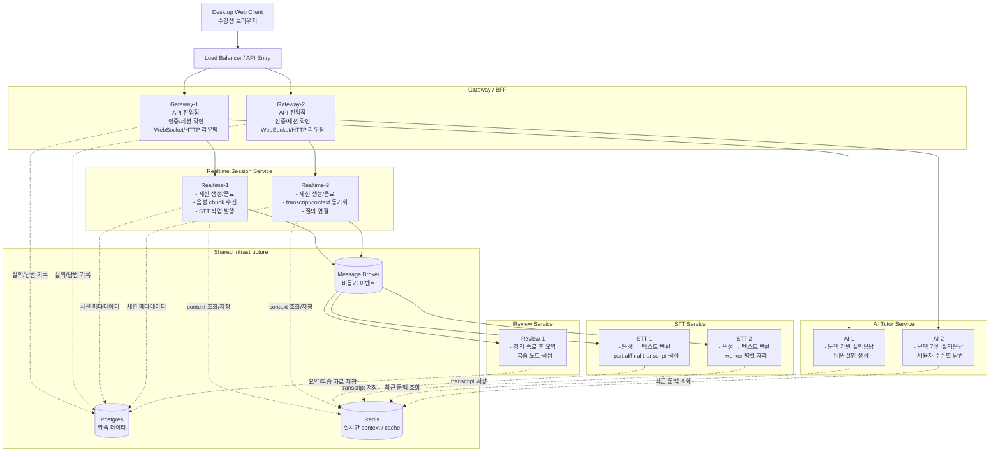
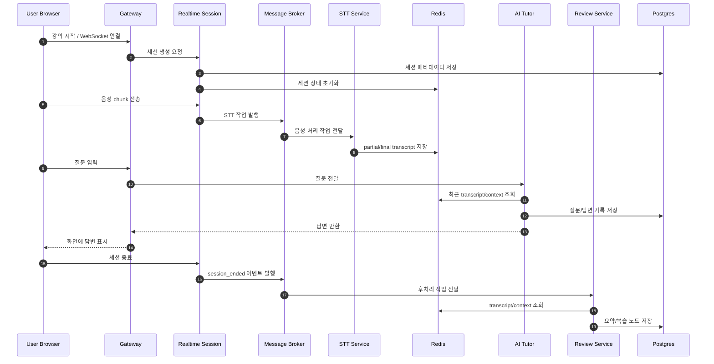

# Listening Mate MSA 인스턴스 설계안

졸업작품 주제인 **Listening Mate** 를 기준으로, 실시간 강의/발표 청취 보조 서비스를 위한 MSA 인스턴스 구성을 정리한 문서다.

## 설계 원칙
- **실시간 연결 처리** 와 **무거운 처리(STT/LLM)** 를 분리한다.
- 졸업작품 규모를 고려해 **과도한 마이크로서비스 분해는 피한다.**
- 발표 시 설명하기 쉽도록 **서비스 책임** 과 **인스턴스 역할** 이 명확해야 한다.
- 초기 MVP는 단일 인스턴스로 시작하고, 발표/확장 설명에서는 수평 확장 구조를 제시한다.

---

## 추천 서비스 구성
- Gateway / BFF
- Realtime Session Service
- STT Service
- AI Tutor Service
- Review Service
- Postgres
- Redis
- Message Broker (RabbitMQ 또는 Redis Streams)

---

## 권장 인스턴스 배치

| 서비스 | 권장 인스턴스 수 | 핵심 역할 |
|---|---:|---|
| Gateway / BFF | 2 | 프론트 진입점, 인증/라우팅, WebSocket/HTTP 연결 관리 |
| Realtime Session Service | 2 | 강의 세션 관리, 음성 chunk 수신, transcript/context 흐름 조율 |
| STT Service | 2+ | 음성을 텍스트로 변환하는 워커 |
| AI Tutor Service | 2+ | 질문응답, 난이도 맞춤 설명 생성 |
| Review Service | 1 | 강의 종료 후 요약/복습 노트 생성 |
| Postgres | 1 | 영속 데이터 저장 |
| Redis | 1 | 실시간 상태, context, 캐시, pub/sub |
| Message Broker | 1 | 서비스 간 비동기 이벤트 전달 |

---

## 전체 인스턴스 구조도

---

## 서비스별 인스턴스 역할 설명

### 1. Gateway / BFF 인스턴스
**역할**
- 프론트엔드가 가장 먼저 붙는 진입점
- 인증, 세션 확인, 요청 라우팅 담당
- 프론트에 맞는 API 형태로 응답 제공

**인스턴스 설명**
- `Gateway-1`: 일부 사용자 요청 처리
- `Gateway-2`: 나머지 사용자 요청 처리
- 두 인스턴스는 같은 역할을 수행하며, 로드밸런서가 트래픽을 분산한다.

**분리 이유**
- 프론트 진입점과 도메인 처리 로직을 분리해 구조를 단순화
- 장애 시 다른 인스턴스로 우회 가능

### 2. Realtime Session Service 인스턴스
**역할**
- 실시간 강의 세션의 생명주기 관리
- 음성 chunk 수신 및 STT 작업 발행
- transcript/context 흐름을 조율하는 오케스트레이터

**인스턴스 설명**
- `Realtime-1`: 세션 A, B 등 일부 실시간 연결 담당
- `Realtime-2`: 세션 C, D 등 나머지 연결 담당
- 상태는 Redis에 두어 특정 인스턴스에 과하게 종속되지 않도록 설계

**분리 이유**
- 실시간 연결 처리와 무거운 STT/LLM 호출을 분리해야 응답성이 좋아짐
- 세션 관리 책임을 명확하게 설명 가능

### 3. STT Service 인스턴스
**역할**
- 음성을 텍스트로 변환
- partial/final transcript 생성
- 외부 STT API 또는 로컬 STT 모델 호출 담당

**인스턴스 설명**
- `STT-1`: queue에서 작업을 가져와 변환 수행
- `STT-2`: 같은 종류의 작업을 병렬 처리
- 트래픽 증가 시 가장 먼저 수평 확장하기 좋은 계층

**분리 이유**
- CPU/GPU 사용량이 높거나 외부 API 비용/지연이 클 수 있음
- Realtime Service 와 분리해야 병목 설명이 명확함

### 4. AI Tutor Service 인스턴스
**역할**
- 최근 transcript/context 기반 질의응답
- 사용자 난이도에 맞는 쉬운 설명 생성
- 필요한 경우 예시 중심 보충 설명 생성

**인스턴스 설명**
- `AI-1`: 일부 질문 요청 처리
- `AI-2`: 나머지 질문 요청 처리
- 같은 역할의 인스턴스를 늘려 질문량 증가에 대응

**분리 이유**
- LLM 호출은 지연시간과 비용이 크므로 독립 확장이 필요
- STT와 다른 부하 특성을 가진다.

### 5. Review Service 인스턴스
**역할**
- 강의 종료 후 transcript, 질문/답변 기록 정리
- 요약 생성, 핵심 키워드 추출, 복습 노트 생성

**인스턴스 설명**
- `Review-1`: 종료된 세션의 후처리 담당
- 실시간 핵심 경로가 아니므로 졸업작품에서는 1개로도 충분

**분리 이유**
- 실시간 경로와 사후 정리 기능을 분리해야 시스템 설명이 깔끔함

### 6. Postgres 인스턴스
**역할**
- 사용자, 강의 세션 메타데이터, 질문/답변 기록, 요약 결과 저장
- 영속 데이터 관리

### 7. Redis 인스턴스
**역할**
- 현재 세션의 최근 transcript/context 저장
- 캐시, pub/sub, 실시간 상태 저장
- 여러 Realtime/AI 인스턴스가 공통 상태를 빠르게 공유하도록 지원

### 8. Message Broker 인스턴스
**역할**
- 서비스 간 비동기 이벤트 전달
- 예시 이벤트: `audio_chunk_received`, `transcript_updated`, `question_created`, `session_ended`
- 서비스 간 결합도를 낮추고, 워커 기반 확장 구조를 설명하기 좋음

---

## 실시간 데이터 흐름

---

## MVP와 확장 설명

### MVP 배포안
- Gateway 1개
- Realtime 1개
- STT 1개
- AI 1개
- Review 1개
- Postgres 1개
- Redis 1개

### 발표/확장 설명용 배포안
- Gateway 2개
- Realtime 2개
- STT 2개 이상
- AI 2개 이상
- Review 1개
- Postgres 1개
- Redis 1개
- Message Broker 1개

---

## 발표 때 한 문장 설명 예시
- **Gateway**: 사용자 요청을 받는 입구이며 인증과 라우팅을 담당한다.
- **Realtime Session**: 실시간 강의 세션의 흐름과 문맥 동기화를 조율한다.
- **STT**: 음성 데이터를 텍스트로 변환하는 병렬 워커 계층이다.
- **AI Tutor**: 강의 맥락과 사용자 수준을 기반으로 답변과 보충설명을 생성한다.
- **Review**: 강의 종료 후 복습을 위한 요약과 정리 자료를 생성한다.
- **Redis**: 실시간 상태와 최근 문맥을 빠르게 공유한다.
- **Postgres**: 영속 데이터와 기록을 저장한다.
- **Broker**: 서비스 간 비동기 이벤트를 전달해 결합도를 낮춘다.
